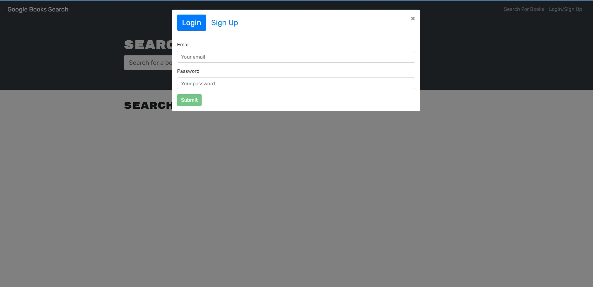
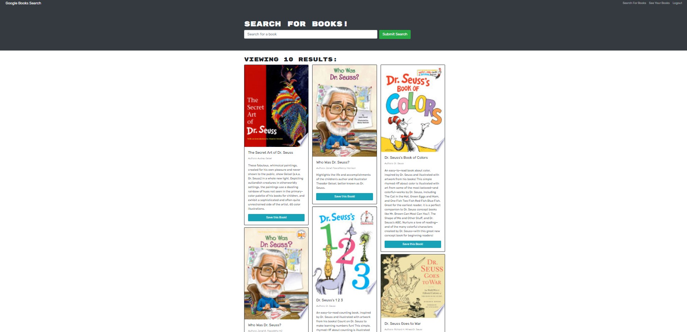
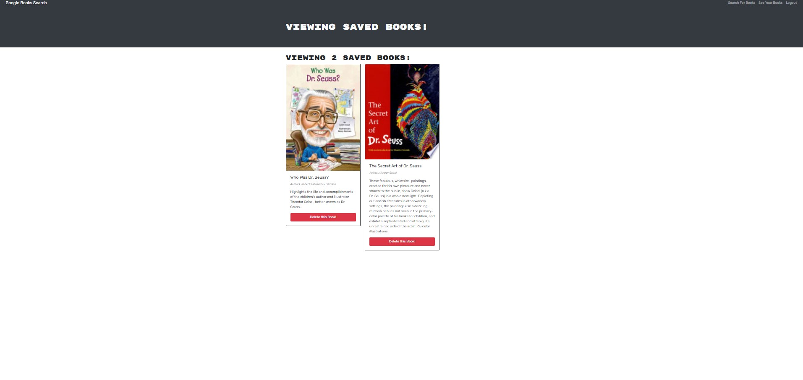
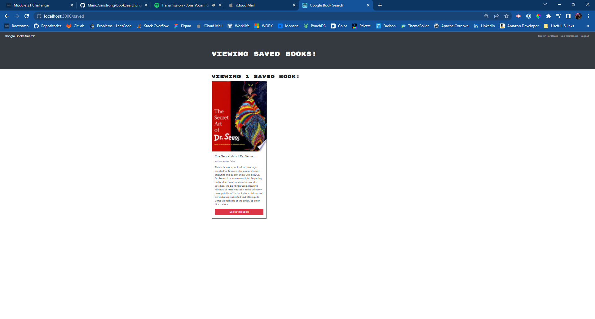
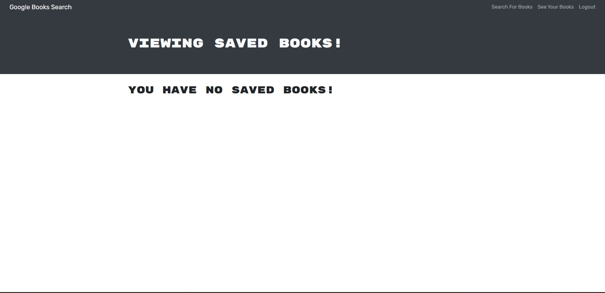

# 🕮 Book Search Engine

[Book Search Engine Live](https://marioarmstrong.github.io/bookSearchEngine/)

## Description

The purpose of this application is to allow the user to search book titles through the Google Books Search API, save selected titles to a personal collection, and delete those titles.

> AS AN avid reader
> I WANT to search for new books to read
> SO THAT I can keep a list of books to purchase

## Table of Contents

- [Descritpion](#description)
- [Installation](#installation)
- [Usage](#usage)
- [Credits](#credits)
- [How to Contribute](#how-to-contribute)
- [License](#license)

## Installation

In order to run this application you must first run `npm install` in the terminal. Make sure you are on the root level before installing all the dependecies. Once that is complete, `npm run seed` in the terminal, which will seed the data provided, and finally run `npm start` to start the server.

## Usage

## Credits

## How to Contribute

## License

Copyright (c) 2022 Mario Armstrong

Permission is hereby granted, free of charge, to any person obtaining a copy
of this software and associated documentation files (the "Software"), to deal
in the Software without restriction, including without limitation the rights
to use, copy, modify, merge, publish, distribute, sublicense, and/or sell
copies of the Software, and to permit persons to whom the Software is
furnished to do so, subject to the following conditions:

The above copyright notice and this permission notice shall be included in all
copies or substantial portions of the Software.

THE SOFTWARE IS PROVIDED "AS IS", WITHOUT WARRANTY OF ANY KIND, EXPRESS OR
IMPLIED, INCLUDING BUT NOT LIMITED TO THE WARRANTIES OF MERCHANTABILITY,
FITNESS FOR A PARTICULAR PURPOSE AND NONINFRINGEMENT. IN NO EVENT SHALL THE
AUTHORS OR COPYRIGHT HOLDERS BE LIABLE FOR ANY CLAIM, DAMAGES OR OTHER
LIABILITY, WHETHER IN AN ACTION OF CONTRACT, TORT OR OTHERWISE, ARISING FROM,
OUT OF OR IN CONNECTION WITH THE SOFTWARE OR THE USE OR OTHER DEALINGS IN THE
SOFTWARE.
